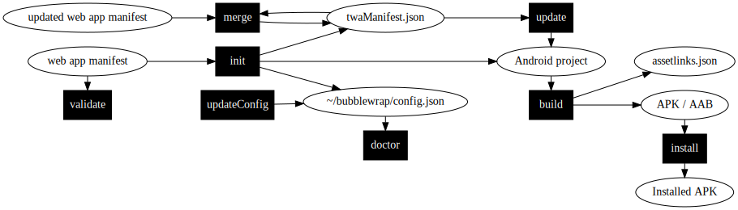

<!---

  Copyright 2019 Google Inc. All Rights Reserved.

   Licensed under the Apache License, Version 2.0 (the "License");
   you may not use this file except in compliance with the License.
   You may obtain a copy of the License at

       http://www.apache.org/licenses/LICENSE-2.0

   Unless required by applicable law or agreed to in writing, software
   distributed under the License is distributed on an "AS IS" BASIS,
   WITHOUT WARRANTIES OR CONDITIONS OF ANY KIND, either express or implied.
   See the License for the specific language governing permissions and
   limitations under the License.
-->
# Bubblewrap CLI


Bubblewrap is a Command Line Interface (CLI) that helps developers to create
a Project for an Android application that launches an existing Progressive Web App (PWA) using a
[Trusted Web Activity (TWA)](https://developer.chrome.com/docs/android/trusted-web-activity/).

## Requirements
- [Node.js](https://nodejs.org/en/) 12.0 or above

## Setting up the Environment

When running Bubblewrap for the first time, it will offer to automatically download and install
external dependencies. This is the recommended setup, but it's possible to
[manually setup the environment](#manually-setting-up-the-environment).

## Container

As an alternative to running the cli on your machine with Node.js directly you can use this 
container image which got the cli and all dependencies pre-installed. To use the cli run
`docker run --rm -ti ghcr.io/GoogleChromeLabs/bubblewrap:latest [cmd]` as you would normally 
use `bubblewrap [cmd]`.

## Quickstart Guide

### Installing Bubblewrap

```shell
npm i -g @bubblewrap/cli
```

:warning: **Warning:** Don't use `sudo npm i -g @bubblewrap/cli` to install Bubblewrap. Using `npm` commands with `sudo`
can create different kinds of problems and should be avoided (see
[here](https://medium.com/@ExplosionPills/dont-use-sudo-with-npm-still-66e609f5f92) and
[here](https://medium.com/@ExplosionPills/dont-use-sudo-with-npm-5711d2726aa3)).

### Initializing an Android Project
Generate an Android project from an existing Web Manifest:

```shell
bubblewrap init --manifest https://my-twa.com/manifest.json
```

When initalizing a project, Bubblewrap will download the Web Manifest and ask you to confirm
the values that should be used when building the Android project.

It will also ask you for the details needed to generate a signing key, used to sign the
app before uploading to the Play Store.

> :grey_exclamation: Even though we recommend Bubblewrap for building and generating a signed
APK, the output from the `init` command is a regular Android project that can be opened
and built using [Android Studio](https://developer.android.com/studio/). Please, refer to the
[documentation]( https://developer.android.com/studio/publish/app-signing#sign-apk) to build and sign
applications using Android Studio.

### Building the Android Project
```shell
bubblewrap build
```

When building the project for the first time, the Android Build Tools will need to be installed.
The tool will inkove the installation process for the build tools. Make sure to read and accept
the license agreement before proceeding. This process will install the other required files inside the `directory/decompressed` root directory of the android CLI package.

As a result of the build step, the tool will generate a signed APK (`app-release-signed.apk`)
that can be used for testing the app and a signed AppBundle (`./app-release-bundle.aab`) that can be [uploaded to the Play Store](https://android-developers.googleblog.com/2020/08/recent-android-app-bundle-improvements.html). You will also need to deploy a Digital Asset Links file to
validate your domain. The
[TWA Quick Start Guide](https://developers.google.com/web/updates/2019/08/twas-quickstart#creating-your-asset-link-file)
explains how to extract the information needed to generate it.

## Commands



The diagram above shows which commands (in the black boxes) take as input or produce as output various files (in white ovals).
An arrow leading to a file means "creates or modifies" and an arrow leading to a command means "is used as input".

## `init`

Usage:

Initializes an Android project for Trusted Web Activity from a Web Manifest. The init script will
parse the Web manifest and generate default values for the Android project, where possible. It
will prompt the user to confirm or input values where one could not be generated.

```
bubblewrap init --manifest="<web-manifest-url>" [--directory="<path-to-output-location>"] [--chromeosonly] [--metaquest]
```

Options:
  - `--directory`: path where to generate the project. Defaults to the current directory.
  - `--chromeosonly`: this flag specifies that the build will be used for Chrome OS only and prevents non-Chrome OS devices from installing the app.
  - `--metaquest`: this flag specifies that the build will be compatible with Meta Quest devices.
  - `--alphaDependencies`: enables features that depend on upcoming version of the Android library
  for Trusted Web Activity or that are still unstable.

## `build`

Builds the project into a final APK that can be uploaded to the Play Store.

The command will ask the user for they key store passwords. Alternatively, users can set the
passwords as enviromental variables, which allows running `build` as part of a continuous integration.
Set `BUBBLEWRAP_KEYSTORE_PASSWORD` for the key store password and `BUBBLEWRAP_KEY_PASSWORD` as the key password.

Usage:

```
bubblewrap build [--skipPwaValidation] [--skipSigning] [--manifest="<path-twa-manifest>"] [--signingKeyPath="<path-to-signing-key>"] [--signingKeyAlias="<key-alias>"]
```

Options:
  - `--skipPwaValidation`: skips validating the wrapped PWA against the Quality Criteria.
  - `--skipSigning`: skips signing the built APK and App Bundle. Other signing-related flags are ignored when this is used.
  - `--signingKeyPath`: path to keystore to use for signing the built APK and App Bundle. Overrides signingKey.path specified in `twa-manifest.json`.
  - `--signingKeyAlias`: key name. Overrides signingKey.alias specified in `twa-manifest.json`.
  - `--manifest`: directory where the client should look for `twa-manifest.json`.


## `update`

Regenerates the Android project files from a `twa-manifest.json` file.

:warning: **Warning:** Bubblewrap doesn't expect the generated Android project to be updated using
external editors. Any files added manually to the Android project will be deleted or overwritten
when `update` is executed. Changes to `twa-manifest.json` are preserved.

Usage:

```
bubblewrap update [--appVersionName="<version-string>"] [--skipVersionUpgrade] [--manifest="<path-twa-manifest>"]
```

Options:
 - `--appVersionName`: version name to be used on on the upgrade. Ignored if `--skipVersionUpgrade` is used.
 - `--skipVersionUpgrade`: skips upgrading `appVersion` and `appVersionCode`.
 - `--manifest`: directory where the client should look for `twa-manifest.json`.

## `validate`

Validates a PWA agains the Quality Criteria for being using in a Trusted Web Activity.

Usage:

```
bubblewrap validate --url=[pwa-url]
```

## `install`

Install the application generated in the output command to a device connected for debugging.

Usage:

```
bubblewrap install [--apkFile="/path-to-apk/apkfile.apk"]
```

Options:
  - `--apkFile`: path to the APK file to be installed. Defaults to `./app-release-signed.apk`.
  - `--verbose`: prints the adb command being executed.

## `help`

Displays a list of commands and options.

Usage:

```
bubblewrap help
```

## `doctor`

Validates that the jdk and the androidSdk are located at the path specified in your config
and that they are at the correct version.

Usage:

```
bubblewrap doctor
```

## `updateConfig`

Sets the paths of the jdk or the androidSdk to the given paths.

Usage:

```
bubblewrap updateConfig  --jdkPath="/path-to-jdk" --androidSdkPath="/path-to-androidSdk"
```

Options:
  - `--jdkPath`: sets the jdk's path to the path given.
  - `--androidSdkPath`: sets the androidSdk's path to the path given.

## `merge`

Merges the user's web manifest into their twaManifest.json.

Usage:

```
bubblewrap merge --ignore [fields-list]
```

Options:
  - `--appVersionName`: version name to be used on on the upgrade. Ignored if `--skipVersionUpgrade` is used.
  - `--skipVersionUpgrade`: skips upgrading `appVersion` and `appVersionCode`.
  - `--ignore`: Ignores all of the fields on the list. Accepts all of the possible fields
  in the Web Manifest.

## `fingerprint`

Manages the list of fingerprints used to generate the Digital Asset Links file for the web application.

Usage:

```
bubblewrap fingerprint [subcommand]
``` 

Global flags:
  - `--manifest=<manifest>`: path to the Trusted Web Activity configuration.',

### Subcommands:

#### `add`
Adds a fingerprint to the project configuration.

Usage:

```
bubblewrap fingerprint add [SHA-256 fingerprint] <flags>
```

Additional flags:
 - `--name=<name>`: optionally set a name to help identify the fingerprint. The name is printed
along with the fingerprint when using the `list` subcommand.

#### `remove`
Removes a fingerprint from the project configuration.

Usage:
```
bubblewrap fingerprint remove [SHA-256 fingerprint] <flags>
```

#### `list`
Lists the fingerprints in the project configuration.

Usage:
```
bubblewrap fingerprint list <flags>
```

#### `generateAssetLinks`
Generates an AssetLinks file from the project configuration

Usage:
```
bubblewrap fingerprint generateAssetLinks <flags>
```

Flags:
 - `--output=<filename>`: path from where to load the project configuration.

## `play`

:warning: This is an experimental feature.

Manages the artifacts for your Google Play Project.

**Note**:
These feature requires a service account file to work correctly. Please see [this documentation](https://github.com/chromeos/pwa-play-billing#setup-a-service-account) for setting up a service account.

The following options can be applied to all of the features commands:
  - `--serviceAccountJsonFile`: sets the service account json file location in the twa-manifest.
  - `--manifest`: specifies the manifest file to use if not in the current directory.

### Subcommands

#### `playPublish`

Usage:

```
bubblewrap playPublish --serviceAccountFile="/path/to/service/account.json" --track="beta" --appBundleLocation="/home/appBundle.aab"
```

Options:
  - `--track`: publishes the prebuilt file to the Google Play Store specificed track (defaults to internal track).
  - `--appBundleLocation`: specifies the location of the appbundle to upload to Google Play (defaults to current directory).

#### `playRetain`

Usage:

```
bubblewrap playRetain --add=86
```

Options:
  - `--add`: specifies the bundles to retain for release (this would be Android only bundles if releasing a Chrome OS only release).
  - `--remove`: removes the specified bundle if no longer relevant.
  - `--list`: shows a list of existing retained bundles in the twa-manifest.json, not what is listed as retained from play.

#### `playVersionCheck`

Usage:

```
bubblewrap playVersionCheck --serviceAccountFile="/path/to/service/account.json"  --targetDirectory="/home/my/app/dir"
```

Options:
  - `--targetDirectory`: the directory that versionCheck should run in (defaults to the current directory). This should be your bubblewrap project directory.

## `twa-manifest.json` reference

The `twa-manifest.json` file is generated as by the `init` comand and contains the configuration of
Android application.

Developers who want to change their application configuration after running `init` can do so by
editing this file then running the `update` command.

Fields:

|Name|Type|Required|Description|
|:--:|:--:|:------:|:---------:|
|additionalTrustedOrigins|string[]|false|A list of additional origins owned by developer and validated with Digital Asset Links. The user will remain in fullscreen mode when navigating to those origins inside the application.|
|alphaDependencies|[AlphaDependencies](#AlphaDependencies)|false|Enables the Android application to use alpha version of dependencies. Defaults to `false`.|
|appVersion|string|false|`versionName` for the Android application. Check the [Android docs](https://developer.android.com/studio/publish/versioning) for details.|
|appVersionCode|number|false|`versionCode` for the Android application. Check the [Android docs](https://developer.android.com/studio/publish/versioning) for details.|
|backgroundColor|string|true|Color used for the splash screen background.|
|display|`'standalone'` \| `'fullscreen'` \| `'fullscreen-sticky'`|false|The initial [display mode](https://developer.mozilla.org/en-US/docs/Web/Manifest/display) for the Android application. `fullscreen-sticky` corresponds to Android's [Immersive Sticky](https://developer.android.com/training/system-ui/immersive#sticky-immersive). Defaults to `standalone`.|
|enableNotifications|boolean|true|Set to `true` to enable notification delegation.|
|enableSiteSettingsShortcut|boolean|false|Adds a shortcut to the site settings in the application launcher. Defaults to `true`.|
|fallbackType|`'customtabs'` \| `'webview'`|false|Fallback strategy used when a browser that supports Trusted Web Activity is not available on the users device. Defaults to `'customtabs'`.|
|features|[Features](#Features)|false|Enables optional features in the Android application. Read the [Features](#Features) section for details.|
|fingerprints|[Fingerprint](#fingerprint)[]|false|List of fingerprints used to generate the Digital Asset Links file. Read the [Fingerprint](#fingerprint) section for details.|
|generatorApp|string|false|Identifier for tool used to generate the Android project. Bubblewrap uses `bubblewrap-cli`. Should only be modified by generator apps.|
|host|string|true|The origin that will be opened in the Trusted Web Activity.|
|iconUrl|string|true|Full URL to an the icon used for the application launcher and splash screen. Must be at least 512x512 px.|
|isChromeOSOnly|boolean|false|Generates an application that targets only ChromeOS devices. Defaults to `false`.|
|isMetaQuest|boolean|false|Generates an application that compatible with Meta Quest devices. Defaults to `false`.|
|launcherName|string|false|A short name for the Android application, displayed on the Android launcher|
|maskableIconUrl|string|false|Full URL to an the icon used for maskable icons, when supported by the device.|
|monochromeIconUrl|string|false|Full URL to a monochrome icon, used when displaying notifications.|
|name|string|true|Name for the Android application, displayed on vairous places when installed on an Android device.|
|navigationColor|string|true|The color used for the navigation bar.|
|navigationColorDark|string|false|The color used for the navigation bar when the device is in dark mode. Defaults to `#000000`.|
|navigationDividerColor|string|false|The color used for the navigation bar divider. Defaults to `#000000`.|
|navigationDividerColorDark|string|false|The color used for the navigation bar divider when the device is dark mode. Defaults to `#000000`.|
|orientation|`'default'` \| `'any'` \| `'natural'` \| `'landscape'` \| `'portrait'` \| `'portrait-primary'` \| `'portrait-secondary'` \| `'landscape-primary'` \| `'landscape-secondary'`|false|Initial orientation used to launch the Android application. Defaults to `'default'`.|
|packageId|string|true|The [application id](https://developer.android.com/studio/build/application-id) for the output Android app.|
|retainedBundles|Array<number>|false|These are the bundles of app bundles that you want to retain when publishing a new bundle.|
|serviceAccountJsonFile|string|false|The Play Store serviced account information. [Guide to setting up](https://github.com/chromeos/pwa-play-billing#setup-a-service-account)|
|shareTarget|[ShareTarget](https://w3c.github.io/web-share-target/#sharetarget-and-its-members)|false|[Web Share Target](https://web.dev/web-share-target/) configuration for the application.|
|shortcuts|[ShortcutInfo](https://developer.mozilla.org/en-US/docs/Web/Manifest/shortcuts)[]|false|[Shortcuts](https://web.dev/app-shortcuts/) configuration for the application.|
|signingKey|[SigningKeyInfo](#SigningKeyInfo)|true|Signing key and alias used to sign the Android application. Read the [SigningKeyInfo](#SigningKeyInfo) section for details.|
|splashScreenFadeOutDuration|number|true|Duration for the splash screen fade out animation.|
|startUrl|string|true|The start path for the TWA. Must be relative to the domain.|
|themeColor|string|true|The color used for the status bar.|
|webManifestUrl|string|false|Full URL to the PWA Web Manifest. Required for the application to be compatible with Chrome OS and Meta Quest devices.|
|fullScopeUrl|string|false|The navigation scope that the browser considers to be within the app. If the user navigates outside the scope, it reverts to a normal web page inside a browser tab or window. Must be a full URL. Required and used only by Meta Quest devices.|
|minSdkVersion|number|false|The minimum [Android API Level](https://developer.android.com/guide/topics/manifest/uses-sdk-element#ApiLevels) required for the application to run. Defaults to `23`, if `isMetaQuest` is `true`, and `19` otherwise.|

### Features

Developers can enable additional features in their Android application. Some features may include more dependencies into the application and increase the binary size.

|Name|Type|Required|Increases Binary Size|Description|
|:--:|:--:|:------:|:-------------------:|:---------:|
|appsFlyer|[AppsFlyerConfig](#appsflyerconfig)|false|true|Read the [AppsFlyerConfig](#appsflyerconfig) section for details.|
|firstRunFlag|[FirstRunFlagConfig](#firstrunflagconfig)|false|false|Read the [FirstRunFlagConfig](#firstrunflagconfig) section for details.|
|locationDelegation|[LocationDelegationConfig](#locationdelegationconfig)|false|true|Read the [LocationDelegationConfig](#locationdelegationconfig) section for details.|
|playBilling|[PlayBillingConfig](#playbillingconfig)|false|true|Read the [PlayBillingConfig](#playbillingconfig) section for details.|

#### AppsFlyerConfig
Enables the [AppsFlyer SDK](https://support.appsflyer.com/hc/en-us/articles/360002330178-Using-AppsFlyer-with-TWA#introduction) in the Android application. Includes additional libraries and is not compatible with Chrome OS.

|Name|Type|Required|Description|
|:--:|:--:|:------:|:---------:|
|appsFlyerId|boolean|true|The appsflyer id.|
|enabled|boolean|true|Set to `true` to enable the feature.|

#### LocationDelegationConfig

Delegates the location permission dialog to the Android system, instead of showing the browser dialog. Recommended when the application requests the location permission, but not enabled by default as it includes additional dependencies in the application. 

|Name|Type|Required|Description|
|:--:|:--:|:------:|:---------:|
|enabled|boolean|true|Set to `true` to enable the feature.|

#### PlayBillingConfig

Enables the Play Billing integration in the application and allows the web application to [use the Digital Goods API to receive payments](https://developer.chrome.com/docs/android/trusted-web-activity/receive-payments-play-billing/). Includes additional dependencies in the Android app.

|Name|Type|Required|Description|
|:--:|:--:|:------:|:---------:|
|enabled|boolean|true|Set to `true` to enable the feature.|

#### FirstRunFlagConfig

Adds an extra query parameter when launching the application, indicating if the application is run for the first time.

|Name|Type|Required|Description|
|:--:|:--:|:------:|:---------:|
|enabled|boolean|true|Set to `true` to enable the feature.|
|queryParameterName|string|true|The query parameter name used to attach the first run information to the `start-url`.|

### AlphaDependencies

|Name|Type|Required|Description|
|:--:|:--:|:------:|:---------:|
|enabled|boolean|false|When set to `true` enables the application to use an alpha version of [`android-browser-helper`](https://github.com/GoogleChrome/android-browser-helper).|


### SigningKeyInfo

Information on filesystem location and alias used to sign the Android application.

|Name|Type|Required|Description|
|:--:|:--:|:------:|:---------:|
|path|string|true|Path to the keystore file in the local filesystem|
|alias|string|true|Alias for the key used to sign the application in the keystore|

### Fingerprint

Information on the signature fingerprints for the application. Use to generate the `assetlinks.json` file and managed by the `fingerprint` command.

|Name|Type|Required|Description|
|:--:|:--:|:------:|:---------:|
|name|string|false|An optional name for the fingerprint.|
|value|string|true|The SHA-256 value for the fingerprint.|

## Manually setting up the Environment

### Get the Java Development Kit (JDK) 11.
The Android Command line tools requires the correct version of the JDK to run. To prevent version
conflicts with a JDK version that is already installed, Bubblewrap uses a JDK that can unzipped in
a separate folder.

Download a version of JDK 11 that is compatible with your OS from
[AdoptOpenJDK](https://adoptopenjdk.net/releases.html?variant=openjdk11&jvmVariant=hotspot)
and extract it in its own folder.

:warning: **Warning:** Using a version lower than 11 will make it impossible to compile the project and higher
versions are incompatible with the Android command line tools.

### Get the Android command line tools
Download a version of Android command line tools that is compatible with your OS from
[https://developer.android.com/studio#command-tools](https://developer.android.com/studio#command-tools).
Create a folder and extract the downloaded file into it. This will further install the androidSdk and android SDK manager without needing to install the whole Android IDE.

### Tell Bubblewrap where the JDK and Android command line tools are
When running `bubblewrap` for the first time, it will ask where it can find the JDK and Android command
line tools. So, take note of the location where both were decompressed.

To ensure if you are taking note of the correct location, check if each directory contains the following files:
- On **Windows** and **Linux**, the correct **OpenJDK** path should contain `bin`, `include` ,`lib`, etc. On **MacOS**,
the directory should contain the `Contents` subdirectory.
- The **AndroidSDK** path should contain `tools` which should have `bin`, `cli`

### Updating the location of the JDK and / or the Android command line tools.
If the location for the JDK or the Android command line tools have been setup with the wrong path or
if their location has changed after the initial configuration, the location for either of those can
be changed by editing the configuration file at `${USER_HOME}/.bubblewrap/config.json`.

#### Sample config.json
```
{
  "jdkPath":"\\user\\home\\bubblewrap-user\\open-jdk",
  "androidSdkPath":"\\user\\home\\bubblewrap-user\\android-cli"
 }

```
*(Note : Make sure you don't have `spaces` in the androidSdkPath. Check [this link](https://stackoverflow.com/questions/37052934/android-sdk-location-should-not-contain-whitespace-as-this-cause-problems-with) for more details.)*

## Contributing

See [CONTRIBUTING](../../CONTRIBUTING.md) for more.

## License

See [LICENSE](../../LICENSE) for more.

## Disclaimer

This is not a Google product.
